**English** | [简体中文](README.md)

<picture>
  <source media="(max-width: 640px) and (prefers-color-scheme: dark)" srcset="assets/presentation/hero-mobile-dark.svg">
  <source media="(max-width: 640px)" srcset="assets/presentation/hero-mobile-light.svg">
  <source media="(prefers-color-scheme: dark)" srcset="assets/presentation/hero-dark.svg">
  
</picture>

**Use a shared CLI for implemented Feishu, DingTalk, WeCom and Tencent Docs resource APIs while managing authorization separately for each suite.**

`v0.8.0` · `Go 1.24+` · [MIT](LICENSE)

[Website](https://suiter.lei6393.com) · [Demo record](docs/demo-results.json)

## Why use it

Office suites have different resources and login flows. suiter uses a Suite interface and shared dispatcher to standardize command shape, with per-suite tokens in one local store. A shared CLI does not authorize every suite with one login: application configuration, permissions and login remain suite-specific.

## Architecture

<picture>
  <source media="(max-width: 640px) and (prefers-color-scheme: dark)" srcset="assets/presentation/architecture-mobile-dark.svg">
  <source media="(max-width: 640px)" srcset="assets/presentation/architecture-mobile-light.svg">
  <source media="(prefers-color-scheme: dark)" srcset="assets/presentation/architecture-dark.svg">
  
</picture>

The Cobra CLI builds a registry of four clients. Reads return JSON and writes consume JSON from stdin. TokenStore persists per-suite tokens; clients validate tokens and handle HTTP/API errors. The agent command separately combines a Feishu read, model summary and DingTalk event creation.

Source entry points: [internal/cli/root.go](internal/cli/root.go) · [internal/cli/auth.go](internal/cli/auth.go) · [internal/cli/agent.go](internal/cli/agent.go) · [internal/config/store.go](internal/config/store.go) · [internal/suite/registry.go](internal/suite/registry.go) · [internal/suite/feishu/client.go](internal/suite/feishu/client.go) · [internal/suite/dingtalk/client.go](internal/suite/dingtalk/client.go) · [internal/suite/wework/client.go](internal/suite/wework/client.go) · [internal/suite/tencentdocs/client.go](internal/suite/tencentdocs/client.go)

## Install

Requires Go 1.24+. The go run example uses production clients with a synthetic expired token. It reads no user token file, starts no login and sends no service request.

```bash
git clone https://github.com/SuperMarioYL/suiter.git
cd suiter
go build -o bin/suiter ./cmd/suiter
```

## Quickstart

Request doc/calendar/message/sheet through four clients and verify each returns a clear re-login error for an expired token. This is offline authentication preflight, not evidence of successful account reads or writes.

```bash
go run ./examples/presentation-demo
```

Complete inputs and execution steps are included in the commands above and the [demo record](docs/demo-results.json).

## Usage

```bash
./bin/suiter suites
./bin/suiter login feishu
./bin/suiter feishu doc read DOCUMENT_ID --json
./bin/suiter logout feishu
```
Configure Feishu application credentials and replace DOCUMENT_ID with an accessible document ID. Other resources use `<suite> <kind> <verb> [id]`; create/send/write consume JSON from stdin. `agent run summarize-and-schedule DOCUMENT_ID` calls a model and creates a calendar event, requiring the appropriate authorization and inputs.

## Recorded demo

<picture>
  <source media="(max-width: 640px) and (prefers-color-scheme: dark)" srcset="assets/presentation/process-mobile-dark.svg">
  <source media="(max-width: 640px)" srcset="assets/presentation/process-mobile-light.svg">
  <source media="(prefers-color-scheme: dark)" srcset="assets/presentation/process-dark.svg">
  
</picture>

### Check an expired token

All four clients reject the expired token before resource access.

```text
$ go run ./examples/presentation-demo
[
  {
    "resource": "doc",
    "result": "feishu: token expired (re-run `suiter login feishu`)",
    "suite": "feishu"
  },
  {
    "resource": "calendar",
    "result": "dingtalk: token expired (re-run `suiter login dingtalk`)",
    "suite": "dingtalk"
  },
  {
    "resource": "message",
    "result": "wework: token expired (re-run `suiter login wework`)",
    "suite": "wework"
  },
  {
    "resource": "sheet",
    "result": "tencentdocs: token expired (re-run `suiter login tencentdocs`)",
    "suite": "tencentdocs"
  }
]
```

## Capabilities and integration

<picture>
  <source media="(max-width: 640px) and (prefers-color-scheme: dark)" srcset="assets/presentation/integrations-mobile-dark.svg">
  <source media="(max-width: 640px)" srcset="assets/presentation/integrations-mobile-light.svg">
  <source media="(prefers-color-scheme: dark)" srcset="assets/presentation/integrations-dark.svg">
  
</picture>

Feishu’s current core reads docs; DingTalk covers calendars, WeCom messages and Tencent Docs sheets. An implemented client and an account with the necessary permissions are separate requirements. The demo only checks local handling of expired tokens.


## Configuration

`--config` selects a file, defaulting to `~/.suiter/config.yaml`; SUITER_ environment variables override configuration values. Credential prefixes are FEISHU_APP, DINGTALK_APP, WEWORK and TENCENTDOCS_CLIENT; model configuration uses SUITER_LLM_BASE_URL/API_KEY/MODEL. Tokens live in `~/.suiter/tokens.json` with mode 0600. logout clears local cache, not server-side authorization; expired tokens require login again.

## Roadmap and scope

Four clients, shared resource dispatch, token caching and a composed summary workflow are implemented. MCP, team identity, a hosted vault and comprehensive token refresh remain future directions.

- No real suite login, platform API, permission or cross-suite write was validated. The existing GIF is a credential-free syntax tour.
- A shared CLI does not provide organization-wide authorization or guarantee every feature and account works across all four services.

 · [Recording script](docs/demo.tape)

## License

[MIT](LICENSE)
