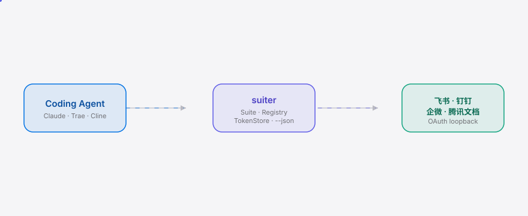

<div align="right"><sub><a href="./README.en.md">English</a>&nbsp;&nbsp;⇄&nbsp;&nbsp;<b>简体中文</b></sub></div>

<picture>
  <source media="(prefers-color-scheme: dark)" srcset="./assets/hero-dark.svg">
  <source media="(prefers-color-scheme: light)" srcset="./assets/hero-light.svg">
  
</picture>

<p align="center"><sub>googleworkspace/cli 但接了飞书/钉钉/企微/腾讯文档——一个 Go 写的 agent CLI，让你的 Coding Agent 读写你自己的飞书文档、钉钉日历、企微消息、腾讯文档，把 4 套 OAuth 收敛成 1 次 <code>suiter login</code>。Agent 现在 org-wide 地 just work 在 CN 办公套件数据上，零 per-app 集成代码。</sub></p>

<p align="center">
  <a href="./LICENSE"></a>
  <a href="https://github.com/SuperMarioYL/suiter/releases/latest"></a>
  
  
  
  
</p>

> **一次 `suiter login` 顶掉 4 套手搓 OAuth 集成——你的 Coding Agent 读写你自己的飞书文档 / 钉钉日历 / 企微消息 / 腾讯文档，零 per-app 胶水代码。**

## 目录

- [什么是 suiter](#什么是-suiter)
- [为什么是现在](#为什么是现在)
- [架构](#架构)
- [安装](#安装)
- [快速开始](#快速开始)
- [用法](#用法)
- [套件](#套件)
- [Agent](#agent)
- [Demo](#demo)
- [配置](#配置)
- [路线图](#路线图)
- [License](#license)

<h2> 什么是 suiter</h2>

suiter 是一个用 Go 写的命令行二进制，你的 Coding Agent 调用它来读写你自己的 CN 办公套件数据。每个子命令都说 `--json` stdio，agent（Claude Code / Trae / Cline）可以直接 pipe 进上下文。一个 `Suite` 接口、一套语法：`suiter <suite> <verb> <id>`。

<h2> 为什么是现在</h2>

googleworkspace/cli 让你的 Agent 读 Google Workspace——但 CN 开发者真正活在飞书/钉钉/企微/腾讯文档里，而 Google Workspace 被 CN 数据出境挡住。每家 CN 套件各自的 OpenAPI + OAuth + 事件 schema 各不相同，今天你为了让 Claude Code 读一篇飞书文档，得手搓 4 套 OAuth（外加 paging、token 刷新、event 订阅）。suiter 把这笔「under the hood」的工程税一次付清并缓存到 `~/.suiter/tokens.json`，你的 Agent org-wide 地 just work 在 CN 办公套件数据上。

```
Before — 4 套手搓 OAuth 集成              After — 1 次 suiter login
┌──────────────────────────────────┐     ┌───────────────────────────────┐
│ feishu SDK   → OAuth #1 ┐        │     │ $ suiter login feishu         │
│ dingtalk SDK → OAuth #2 │ 4× glue│     │ $ suiter login dingtalk       │
│ wework SDK   → OAuth #3 │        │     │ $ suiter login wework         │
│ tencent SDK  → OAuth #4 ┘        │     │ $ suiter login tencentdocs    │
│ (各自 paging / refresh / events) │     │ → ~/.suiter/tokens.json (1 个) │
└──────────────────────────────────┘     └───────────────────────────────┘
```

<h2> 架构</h2>

<picture>
  <source media="(prefers-color-scheme: dark)" srcset="./assets/atlas-dark.svg">
  <source media="(prefers-color-scheme: light)" srcset="./assets/atlas-light.svg">
  
</picture>

单二进制，进程内，无 daemon、无 server、无 K8s：Cobra CLI → Suite 注册表 → 4 个套件客户端，背后是共享的 `TokenStore`（`~/.suiter/tokens.json`）和一个薄的 OpenAI 兼容 LLM 客户端（GLM / DeepSeek，不自建模型）。

<h2> 安装</h2>

```bash
go install github.com/SuperMarioYL/suiter@latest
```

需要 Go 1.24+。二进制落到 `$GOPATH/bin`。

<h2> 快速开始</h2>

```bash
export SUITER_FEISHU_APP_ID=cli_xxx SUITER_FEISHU_APP_SECRET=xxx   # open.feishu.cn 控制台取
suiter login feishu                                                  # 一次 OAuth loopback，token 缓存
suiter feishu doc read <doc-id> --json                               # 文档正文 → agent-readable JSON
```

<details><summary>sample output</summary>

```json
{
  "code": 0,
  "msg": "success",
  "data": { "content": "周会纪要：1) 7/30 发版 ... 2) 负责人 @张三 ..." }
}
```

</details>

<h2> 用法</h2>

```bash
# 1) 一次 OAuth loopback，token 缓存到 ~/.suiter/tokens.json
suiter login feishu

# 2) 飞书文档正文 → JSON 输出到 stdout
suiter feishu doc read <doc-id> --json

# 3) pipe 进你的 Coding Agent
suiter feishu doc read <doc-id> --json | your-agent summarize

# 4) 列出已注册套件
suiter suites

# 5) m3 端到端 loop（占位）：读飞书 → GLM 摘要 → 钉钉日历事件
suiter agent run summarize-and-schedule <doc-id>
```

更多见 [`examples/`](./examples)。

<h2> 套件</h2>

| 套件 | 状态 | v0.1 动词 |
|---|---|---|
| 飞书 feishu | m1 ✓ | `login`，`doc read` |
| 钉钉 dingtalk | m2 | `login`，`calendar list/create` |
| 企微 wework | m2 | `login`，`message send/read` |
| 腾讯文档 tencentdocs | m3 | `login`，`sheet read/write` |

每个套件实现同一个 `Suite` 接口（`Name` / `Login` / `Read` / `Write`），挂在同一个 `Suite` 注册表后；新增套件动词零新增 CLI 胶水——这就是统一抽象要证明的事。

<h2> Agent</h2>

明星时刻（m3）是一个 60 秒的 loop：`suiter feishu doc read <id> --json` → GLM/DeepSeek `summarize` → `suiter dingtalk calendar create`。v0.1 已在每个动词上开放 `--json` stdio，Agent 今天就能 orchestrate；`suiter agent run summarize-and-schedule` 在 m3 把 loop 端到端串起来。完整的 MCP server 是 v0.2 路线——v0.1 先证明统一抽象，再封 MCP。

<h2> Demo</h2>


> 由 CI 从 [`docs/demo.tape`](./docs/demo.tape)（vhs）渲染。手动刷新用 `demo` workflow。

<h2> 配置</h2>

优先级：命令行 `--config <path>` > 环境变量 > `~/.suiter/config.yaml`。

| Key | 环境变量 | 默认 | 含义 |
|---|---|---|---|
| `feishu_app_id` | `SUITER_FEISHU_APP_ID` | `""` | 飞书 app_id |
| `feishu_app_secret` | `SUITER_FEISHU_APP_SECRET` | `""` | 飞书 app_secret |
| `dingtalk_app_key` | `SUITER_DINGTALK_APP_KEY` | `""` | 钉钉 appKey（m2） |
| `dingtalk_app_secret` | `SUITER_DINGTALK_APP_SECRET` | `""` | 钉钉 appSecret（m2） |
| `wework_corp_id` | `SUITER_WEWORK_CORP_ID` | `""` | 企微 corpId（m2） |
| `wework_agent_id` | `SUITER_WEWORK_AGENT_ID` | `""` | 企微 agentId（m2） |
| `wework_secret` | `SUITER_WEWORK_SECRET` | `""` | 企微 secret（m2） |
| `tencentdocs_client_id` | `SUITER_TENCENTDOCS_CLIENT_ID` | `""` | 腾讯文档 clientId（m3） |
| `tencentdocs_client_secret` | `SUITER_TENCENTDOCS_CLIENT_SECRET` | `""` | 腾讯文档 clientSecret（m3） |

token 缓存在 `~/.suiter/tokens.json`（0600 权限，单 dev 本机；多用户 / 云 vault 明确 out of scope）。

<h2> 路线图</h2>

- [x] **m1** — `suiter login feishu` + `suiter feishu doc read <id> --json`；token 缓存到 `~/.suiter/tokens.json`，跨 session 存活。
- [ ] **m2** — 抽出 `Suite` 接口 + 注册表；钉钉（`calendar list/create`）+ 企微（`message send/read`）挂在同一套 `suiter <suite> <verb>` 语法 + 共享 `TokenStore` 后。
- [ ] **m3** — 腾讯文档（`sheet read`）+ GLM/DeepSeek 摘要器；端到端 `suiter agent run summarize-and-schedule`。
- [ ] 未来 — MCP server（v0.2）、团队 auth、托管 token vault。

推送后建议加 repo topics：

```bash
gh repo edit --add-topic coding-agent --add-topic cli --add-topic feishu --add-topic dingtalk
```

<h2> License</h2>

MIT — 见 [LICENSE](./LICENSE)。在 [GitHub Issues](https://github.com/SuperMarioYL/suiter/issues) 提 issue 或 PR。

<p align="center"><sub><a href="./LICENSE">MIT</a> © 2026 SuperMarioYL</sub></p>
